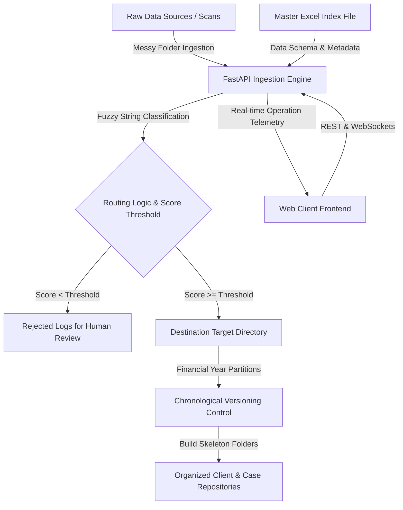

# ⚡ InnovaFlow — Industrial-Grade Document Organizer

[](https://fastapi.tiangolo.com/)
[](https://developer.mozilla.org/en-US/docs/Web/HTML)
[](https://developer.mozilla.org/en-US/docs/Web/CSS)
[](https://developer.mozilla.org/en-US/docs/Web/JavaScript)
[](https://www.python.org/)
[](https://github.com/)

**InnovaFlow** is a secure, high-performance, internal organizational document ingestion and routing pipeline. Operating entirely on local networks, it automatically classifies incoming unstructured document folders, associates them with master database entries across financial year partitions, maintains chronological file revisions, and presents deep real-time analytics.

---

## 🏗️ System Architecture

InnovaFlow splits operational responsibility between an ultra-low latency **FastAPI** Python backend and a high-density, responsive **Vanilla HTML5/JS/CSS** bento-grid dashboard.



---

## ✨ Features & Capabilities

### 🎛️ Responsive Bento-Grid Workspace
*   **Unified Control Center:** Configure directory mappings, import master excel files, select target financial years, and initiate processing sweeps.
*   **Native File Dialog Integrations:** Browse folders and Excel records locally using Tkinter-backed system wrappers.
*   **Security Access Gate:** Restricted entry protected by localized authorization protocols (Default security key: `INNOVUS2026`).

### 📂 Interactive Year Explorer
*   **Dynamic Year Partitions:** Drill down into specific financial years (e.g. `FY 2023-24`, `FY 2022-23`).
*   **High-Fidelity Search:** Quick-find directories by Case ID, Party, Path, or File using a unified command-palette search wrapper (`Ctrl + K`).
*   **In-App File Tree Preview:** Scan folder structures and nested document outputs directly without leaving the web client.
*   **Shell Integration:** Instantly open directory roots or individual dockets inside Windows Explorer or macOS Finder.

### 📊 Real-Time Operations Telemetry
*   **Bi-directional Event Streaming:** Monitor scans, duplicate checks, routing rules, and ingest metrics via persistent WebSocket pipelines.
*   **Operational Reports:** Trace audit logs, total items processed, and accuracy metrics for every processing cycle.
*   **Advanced Data Visualization:** Inspect storage allocations, file growth, and case type distributions (Litigation, Corporate, Audit).

---

## ⚙️ Core Technical Algorithms

### 🧠 1. The 4-Pronged AI Matching Engine

Migrating files from human-generated folders into structured databases is notoriously difficult due to data entry errors, missing metadata, and varying spelling conventions.

To solve this, this API utilizes a custom **4-Pronged AI Matching Engine** powered by fuzzy logic. Instead of relying on a single string comparison, the algorithm evaluates every folder through four distinct analytical lenses and safely routes the file based on the highest confidence score.

#### 🛡️ The Pre-Requisite: The Strict Gatekeeper

Before the 4 prongs can score a folder, it must pass the **Gatekeeper Validation**. This prevents "False Positives" where a folder perfectly matches a Bank and Branch, but belongs to a completely different person.

The Gatekeeper uses an **Initials-Anchored Typo Failsafe**:

1. **Primary Anchor Extraction:** It extracts the first significant word (≥ 3 characters) from the expected client name.
2. **Initial Verification:** It checks if any word in the messy folder name shares the exact same starting letter.
3. **Length & Typo Constraint:** The two words must be within 3 characters in length (`abs(len1 - len2) <= 3`) and have at least a 50% phonetic similarity.

* **✅ Pass Example (`Nur` vs `Noor`):** Initials match ('N'), length difference is 1, fuzzy score > 50%. The Gatekeeper unlocks the scoring engine.
* **❌ Fail Example (`Ramkrishna` vs `Partha`):** Initials mismatch, failing the anchor check. The Gatekeeper hard-caps the final matching score at **30%**, permanently rejecting the file regardless of bank/branch matches.

---

#### ⚙️ The 4 Scoring Prongs

If the folder passes the Gatekeeper, it is evaluated by the following four algorithms. The AI automatically takes the `max()` score of these four prongs.

##### 1. Full Token Match (`fuzz.token_set_ratio`)

This compares the fully concatenated string (`Bank + Branch + Client`) against the messy folder name.

* **Use Case:** Best for folders that follow the standard naming convention with minor character variations.
* **Engine:** Uses `thefuzz` token set ratio, which is agnostic to word order (e.g., "SBI SME John Doe" equals "John Doe SBI SME").

##### 2. Client-Only Fallback

This strips out the expected Bank and Branch and tests *only* the Client name against the folder name.

* **Use Case:** Crucial for folders where the user completely forgot to type the Bank or Branch name, or used an unrecognizable abbreviation for them.

##### 3. Compact Prefix Scanner (The "Squish" Logic)

Fuzzy algorithms fail heavily when spaces are inserted or removed (e.g., "Radha Krishna" vs "Radhakrishna").

* **Engine:** This prong removes all spaces, underscores, and punctuation from both the expected name and the folder name, creating a compact string (e.g., `radhakrishna`).
* **Validation:** It extracts the first 8 characters of the expected compact string and searches for that exact substring inside the compact folder name. If found, it establishes a solid baseline score of 75%.

##### 4. Generous Keyword Overlap

A failsafe for heavily cluttered folders containing dates, random employee names, or internal tracking codes.

* **Engine:** Breaks the expected string into individual significant keywords (>2 characters).
* **Validation:** It scans the folder name for these specific keywords. The score is a pure mathematical fraction: `(Matched Words / Total Expected Words) * 100`.
* **Bonus:** If it successfully finds at least 2 key words scattered anywhere in the folder name, it grants an automatic `+15%` confidence boost.

---

#### 🎁 Explicit Metadata Bonuses

To reward highly accurate data entry, the engine applies explicit bonuses for exact Bank and Branch matches. **(Note: These are only applied if the Gatekeeper verifies the client identity).**

Both strings are squished to ignore spaces and punctuation.

* **Bank Bonus (`+10%`):** If the exact squished bank name (e.g., `sbi`, `pnb`) exists in the folder string.
* **Branch Bonus (`+15%`):** If the exact squished branch name (e.g., `rasmeccc`, `sme`, `sarb`) exists in the folder string.

**Result:** If a folder scores a `75%` via the *Compact Prefix Scanner*, but contains the exact Bank (`+10`) and Branch (`+15`), the final confidence score rockets to `100%`, guaranteeing a safe and highly accurate migration.

---

### ⏱️ 2. Chronological Smart Copy & Versioning
To prevent document overwrites and loss of historical notes during repeated scans, InnovaFlow enforces a strict chronological file-versioning rule.

*   **MTime Verification:** Files are read and matched using precise byte-size and last-modified time (`mtime`) hashes. Exact duplicates are discarded immediately to save network storage.
*   **Sequential Shuffling:** When a newer or modified copy of an existing document is identified, the backend reorganizes all versions.
*   **Zero-Loss Naming Convention:**
    *   **Oldest File:** `Document_Name.ext`
    *   **Version 1 Revision:** `Document_Name_v1.ext`
    *   **Version 2 Revision:** `Document_Name_v2.ext`
    *   *System files are ordered chronologically based on their original modified metadata rather than local arrival order.*

---

## 🛠️ Installation & Setup

### Prerequisites
*   **Python:** Version 3.10 or higher.
*   **Web Browser:** Modern web browser supporting ES6 Javascript and WebSockets.

### 1. Backend Server Setup
From the repository root, install dependencies and launch the Uvicorn web server:

```powershell
# Create a Python virtual environment
python -m venv .venv

# Activate the virtual environment
# On Windows:
.venv\Scripts\activate
# On macOS/Linux:
source .venv/bin/activate

# Install required packages
pip install fastapi uvicorn pandas openpyxl thefuzz python-Levenshtein

# Run the FastAPI server (Default Port: 8000)
uvicorn innovas.api_server:app --reload
```

### 2. Frontend Interface Launch
Since the web application is built on lightweight, performant Vanilla JS modules, it doesn't require a compilation step:
1. Double-click the root [index.html](file:///c:/Users/sneha/Desktop/innovas/index.html) or [Innovaflow/index.html](file:///c:/Users/sneha/Desktop/innovas/Innovaflow/index.html) in your workspace.
2. The landing page will automatically redirect you to the authorization dialogue.
3. Enter the Access Key: `INNOVUS2026` to unlock the dashboard.

---

## 🗃️ Repository Structure

```text
├── .git/                      # Version control database
├── Innovaflow/                # Vanilla JS Web Dashboard
│   ├── index.html             # Landing authentication portal
│   ├── dashboard.html         # Main configuration board
│   ├── explorer.html          # File explorer and tree previewer
│   ├── logs.html              # Live streaming operations log
│   ├── reports.html           # Ingest run historical results
│   ├── analytics.html         # Analytical plots & charts
│   ├── settings.html          # Config parameters and thresholds
│   ├── style.css              # Custom styling definitions
│   └── app.js                 # Global state management and API calls
├── innovas/                   # FastAPI Python Server
│   ├── api_server.py          # Routing server & fuzzy indexers
│   └── year_paths.py          # Fiscal year storage mapping definitions
├── index.html                 # Main redirect hub
└── README.md                  # System Documentation
```

---
*For internal administrative access only. Log-level audits are permanently active.*
